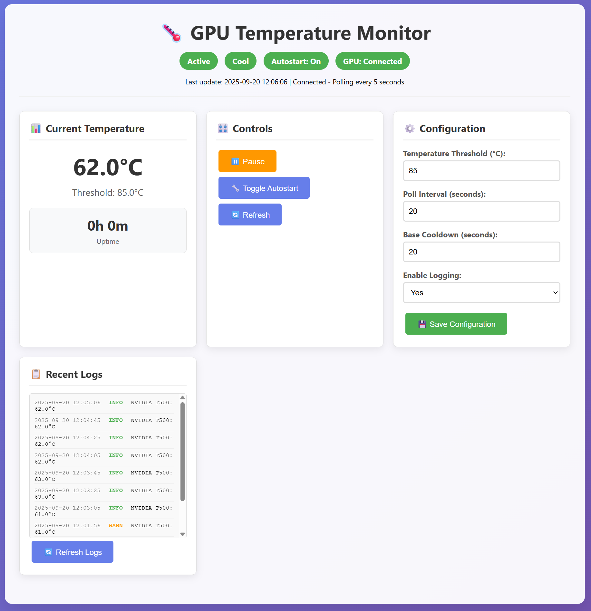
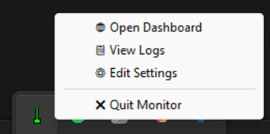

# GpuTempWatch 🌡️

<!-- Language Switcher -->
[](README.md)
[](README.ru.md)

A lightweight Rust application for monitoring GPU temperatures using NVIDIA Management Library (NVML). Provides real-time temperature monitoring with system tray integration, Windows toast notifications, web-based configuration interface, and comprehensive logging.

## Features

- 🔥 **Real-time GPU Temperature Monitoring** - Direct NVML integration for accurate readings
- 🖥️ **Web Dashboard** - Modern web interface on `localhost:18235` for configuration and monitoring
- 🔔 **Smart Notifications** - Windows toast notifications with exponential backoff cooldown
- 📊 **System Tray Integration** - Color-coded temperature indicators and quick controls
- 📝 **Comprehensive Logging** - JSON structured logs with automatic rotation
- ⚡ **Auto-start Support** - Windows startup integration via registry
- 🛠️ **Live Configuration** - Real-time settings updates without restart

## Screenshots

### Web Interface


The web dashboard provides:
- **Current Temperature Display** with threshold indicator
- **Status Indicators** (Active, Temperature State, Autostart, GPU Connection)
- **Control Panel** with Pause, Toggle Autostart, and Refresh buttons
- **Configuration Settings** for temperature threshold, polling interval, cooldown, and logging
- **Recent Logs View** with real-time updates and filtering

### System Tray


The system tray offers quick access to:
- **Open Dashboard** - Launch web interface
- **View Logs** - Open log files
- **Edit Settings** - Quick configuration access
- **Quit Monitor** - Exit application

## Installation & Setup

### System Requirements
- NVIDIA GPU with compatible drivers
- Windows 10/11 (for toast notifications)
- No additional dependencies required

### Download & Build

#### Pre-built Release
1. Download the latest release from the repository
2. Extract `gpu-temp-watch.exe` to your preferred location
3. Run the executable

#### Build from Source
```bash
# Clone the repository
git clone &lt;repository-url&gt;
cd GpuTempWatch

# Build debug version
cargo build

# Build optimized release version (~1.2MB executable)
cargo build --release
```

### First Run
1. Launch the application: `./target/release/gpu-temp-watch.exe`
2. The application will:
   - Create configuration file at `%LOCALAPPDATA%\GpuTempWatch\config.json`
   - Set up logging directory at `%LOCALAPPDATA%\GpuTempWatch\Logs\`
   - Start system tray monitoring
   - Launch web interface at `http://localhost:18235`

## Usage

### Starting the Application

#### Development Mode
```bash
cargo run
```

#### Release Mode
```bash
# Direct execution
./target/release/gpu-temp-watch.exe

# Or from Windows Explorer
# Double-click gpu-temp-watch.exe
```

### Web Interface Access
Open your browser and navigate to: `http://localhost:18235`

#### Dashboard Features
- **Temperature Monitoring**: Real-time GPU temperature display with color-coded status
- **Uptime Tracking**: Monitor how long the application has been running
- **Control Panel**:
  - Pause/Resume monitoring
  - Toggle autostart on Windows boot
  - Manual refresh of readings
- **Configuration Panel**:
  - Temperature threshold (°C)
  - Poll interval (seconds)
  - Base cooldown for notifications (seconds)
  - Enable/disable logging
- **Recent Logs**: View latest log entries with real-time updates

### System Tray Controls
- **Icon Colors**:
  - 🟢 Green: Temperature below threshold
  - 🟡 Yellow: Temperature approaching threshold
  - 🔴 Red: Temperature above threshold
- **Right-click Menu**: Access all application features
- **Double-click**: Open web dashboard

### Toast Notifications
Smart notification system with exponential backoff:
- **First Alert**: Immediate when temperature exceeds threshold
- **Subsequent Alerts**: 20s → 40s → 80s → 160s → 320s (max)
- **Reset**: Cooldown resets when temperature drops below threshold

## Configuration

### Configuration File Location
- **Primary**: `%LOCALAPPDATA%\GpuTempWatch\config.json`
- **Fallback**: `./config.json` (current directory)

### Configuration Parameters

```json
{
  "temperature_threshold_c": 80.0,    // Temperature threshold in Celsius
  "poll_interval_sec": 20,            // How often to check temperature
  "base_cooldown_sec": 20,            // Base notification cooldown
  "enable_logging": true,             // Enable file logging
  "log_file_path": "%LOCALAPPDATA%\\GpuTempWatch\\Logs\\gpu-temp-watch.log"
}
```

#### Parameter Details
- **temperature_threshold_c**: Temperature threshold for alerts (default: 80°C)
- **poll_interval_sec**: Interval between temperature checks (default: 20 seconds)
- **base_cooldown_sec**: Base cooldown between notifications (default: 20 seconds)
- **enable_logging**: Enable/disable file logging (default: true)
- **log_file_path**: Path to log file (supports environment variables)

### Live Configuration Updates
Changes made via the web interface are applied immediately without requiring an application restart.

## Logging System

### Log Locations
- **Primary**: `%LOCALAPPDATA%\GpuTempWatch\Logs\gpu-temp-watch.log`
- **Fallback**: `./Logs/gpu-temp-watch.log`

### Log Features
- **Dual Output**: Console (human-readable) and file (JSON structured)
- **JSON Format**: Structured logs with correlation IDs and timestamps
- **Automatic Rotation**: 10MB file size limit, keeps 5 rotated files
- **Thread-Safe**: Concurrent access support
- **Multiple Levels**: Trace, Debug, Info, Warn, Error

### Monitoring Logs

#### Real-time Monitoring (PowerShell)
```powershell
# Monitor logs in real-time
Get-Content "$env:LOCALAPPDATA\GpuTempWatch\Logs\gpu-temp-watch.log" -Wait -Tail 10

# View recent entries
Get-Content "$env:LOCALAPPDATA\GpuTempWatch\Logs\gpu-temp-watch.log" -Tail 20

# Open logs directory
explorer "$env:LOCALAPPDATA\GpuTempWatch\Logs"
```

#### Log Analysis
```powershell
# Filter for errors
Get-Content "$env:LOCALAPPDATA\GpuTempWatch\Logs\gpu-temp-watch.log" | Select-String "ERROR"

# Filter for temperature alerts
Get-Content "$env:LOCALAPPDATA\GpuTempWatch\Logs\gpu-temp-watch.log" | Select-String "temperature_alert"
```

## Development Commands

### Building
```bash
# Check for compilation errors
cargo check

# Build debug version
cargo build

# Build optimized release
cargo build --release

# Clean build artifacts
cargo clean
```

### Testing
```bash
# Run tests
cargo test

# Run tests with output
cargo test -- --nocapture
```

### Development Monitoring
```bash
# Run with detailed logging
RUST_LOG=debug cargo run

# Run with trace logging
RUST_LOG=trace cargo run
```

## Architecture Overview

### Core Components
- **NVML Integration** (`monitor.rs`): Direct GPU temperature readings
- **System Tray** (`tray.rs`): Native Windows tray with dynamic icons
- **Web Server** (`web_server.rs`): HTTP/WebSocket server for real-time interface
- **Toast Notifications** (`notifications.rs`): Smart Windows notifications with backoff
- **Unified Logging** (`logger_service.rs`): Console and file logging with JSON structure
- **Configuration** (`config.rs`): JSON-based settings with live updates
- **Autostart** (`autostart.rs`): Windows registry integration
- **Path Management** (`app_paths.rs`): Centralized application data locations

### Performance Benefits vs PowerShell
- ✅ **Memory Usage**: &lt;2MB vs 20MB+ (PowerShell)
- ✅ **Startup Time**: Instant vs several seconds
- ✅ **Resource Efficiency**: Minimal CPU usage
- ✅ **No Dependencies**: Self-contained executable
- ✅ **Native Performance**: Direct NVML integration
- ✅ **Reliability**: No execution policy issues
- ✅ **Size**: 1.2MB executable vs multiple script files

## Troubleshooting

### Common Issues

#### "No NVIDIA GPU found"
- Ensure NVIDIA drivers are installed and up to date
- Verify GPU is recognized by Windows Device Manager
- Check if other NVIDIA software (like GeForce Experience) can detect the GPU

#### "Failed to initialize NVML"
- Update NVIDIA drivers to the latest version
- Restart Windows after driver installation
- Ensure the GPU is properly seated and powered

#### Web interface not accessible
- Check if port 18235 is blocked by firewall
- Verify the application is running (check system tray)
- Try accessing via `127.0.0.1:18235` instead of `localhost:18235`

#### Toast notifications not appearing
- Ensure Windows 10/11 is being used
- Check Windows notification settings
- Verify notifications are enabled for the application in Windows Settings

#### Autostart not working
- Run the application as administrator once to register autostart
- Check Windows Task Manager → Startup tab for the entry
- Manually verify registry entry exists

### Log Analysis for Troubleshooting
```powershell
# Check for initialization errors
Get-Content "$env:LOCALAPPDATA\GpuTempWatch\Logs\gpu-temp-watch.log" | Select-String "startup\|initialization\|error" | Select-Object -Last 20

# Check web server status
Get-Content "$env:LOCALAPPDATA\GpuTempWatch\Logs\gpu-temp-watch.log" | Select-String "web_server\|http" | Select-Object -Last 10

# Check NVML connectivity
Get-Content "$env:LOCALAPPDATA\GpuTempWatch\Logs\gpu-temp-watch.log" | Select-String "nvml\|gpu\|temperature" | Select-Object -Last 15
```

## Contributing

This project was developed using Claude Code (Sonnet 4) and follows Rust best practices for system integration and performance optimization.

### Development Environment
- **Platform**: Windows (win32)
- **Language**: Rust 2021 Edition
- **Architecture**: Async/await with Tokio runtime
- **GUI**: Native Windows APIs with web-based configuration

## License

[Add your license information here]

## Acknowledgments

- Built with Rust for optimal performance and safety
- Uses NVIDIA NVML for accurate temperature readings
- Developed with Claude Code assistance for rapid prototyping and optimization